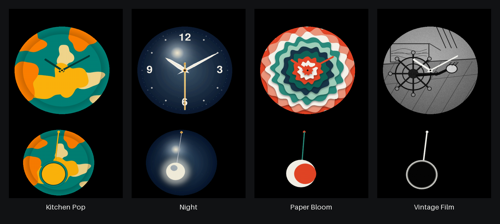
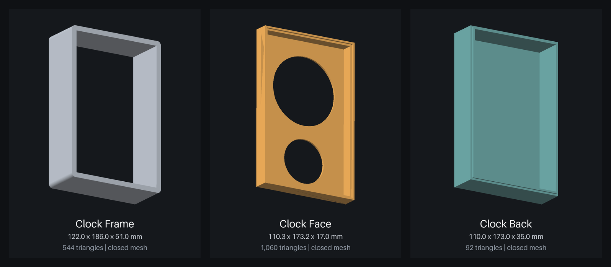

# Pi Klydo Clock

An offline-first animated art clock for a Raspberry Pi 3 and a portrait 7-inch
DSI display. The repository contains both the native clock renderer and a browser
designer that exports installable clock-face packages.



## Highlights

- Native SDL2/Pygame renderer with PyAV video loops; Chromium is not required on the Pi.
- Real-time analog hands rendered independently from the background animation.
- Animated pendulum art with configurable period, amplitude, pivot, and backdrop.
- JSON-configurable display geometry shared by the renderer and design tool.
- Built-in designs plus SD-card and SCP design-folder discovery after every boot.
- DS3231 RTC support, NTP synchronization, and SoftAP Wi-Fi provisioning.
- React/Vite designer with deterministic H.264 export and package validation.

The target enclosure uses a **480 x 800** display behind two circular cutouts:

- **Top circle** — a **400 px** looping design video/animation with **real-time analog hands
  composited on top as an independent layer** (the hands are driven by the clock, not
  the video, so they stay correct no matter what the animation does). The background
  fills the complete opening; the 3D-printed faceplate supplies the visible edge.
- **Bottom circle** — a **300 px themed swinging pendulum**, colour/period/amplitude matched
  to the active design.

Designs live on the SD card, one folder each. Timekeeping supports a **DS3231 RTC** (correct
with no network); Wi-Fi is provisioned via a **SoftAP captive portal** without touching
the display.

See [`DESIGN_REVIEW.md`](DESIGN_REVIEW.md) for why this replaced the original Chromium/HTML
artifact (kept in [`legacy/`](legacy/)). See [`UI_CONFIGURATION.md`](UI_CONFIGURATION.md)
for the design-folder contract, daily/manual selection logic, and future GPIO/remote
control extension points.

---

## Repo layout

```
DESIGN_REVIEW.md        findings on the old HTML + the architecture decision
UI_CONFIGURATION.md     design-folder schema, controls, AI design contract
COMMUNITY_DESIGNS.md    SD-card/SCP copy workflow + artist package contract
config/clock.json       shared device geometry, folders, and design limits
docs/images/            renderer-generated design screenshots for documentation
3d_enclosure/*.stl      printable frame, faceplate, and rear enclosure meshes
Tools/clock-design-creator-app/app/
                        Browser editor for building validated design ZIPs
CLAUDE_DESIGN_APP_PROMPT.md prompt for building a design creator app
legacy/Pi Clock.html    the original bundled-React artifact (kept, untouched)
designs/<name>/         one folder per design (fully self-describing)
  loop.mp4|webm         background animation for the top circle (480×480)
  pendulum.png|svg      pendulum sprite (pivot at top-centre)
  theme.json            hands, dial, pendulum physics, ambiance
src/piclock/            the renderer (see cli.py for entry point)
scripts/                install, validation, generators, and preview rendering
provisioning/           comitup.conf (SoftAP captive portal)
systemd/                renderer + RTC-sync units
boot/                   config.txt snippet + cmdline.txt notes
```

On the Pi, community/user designs are also scanned at startup from:

```text
/boot/firmware/piclock-designs/
/boot/piclock-designs/
~/piclock-designs/
```

---

## 3D-printable enclosure



The [`3d_enclosure/`](3d_enclosure/) directory contains the three closed, manifold
binary STL meshes used for the clock enclosure. Import them into the slicer at 100%
scale and interpret the unitless STL coordinates as millimetres.

| File | Part | Mesh bounding box |
| --- | --- | --- |
| [`clock_frame.stl`](3d_enclosure/clock_frame.stl) | Outer frame and surround | 122.0 x 186.0 x 51.0 mm |
| [`clock_face.stl`](3d_enclosure/clock_face.stl) | Front insert with dial and pendulum openings | 110.34 x 173.216 x 17.0 mm |
| [`clock_back.stl`](3d_enclosure/clock_back.stl) | Rear enclosure shell | 110.0 x 173.0 x 35.0 mm |

The dimensions above are axis-aligned mesh bounds, not recommended print
orientation. Confirm display fit, connector clearance, shrinkage, and printer
tolerances before a production print. Regenerate the documentation renders after
changing an STL with:

```bash
./.venv/bin/python scripts/render_stl_previews.py
```

---

## Quick start (development, on a Mac/PC)

```bash
python3 -m venv .venv && ./.venv/bin/pip install -r requirements.txt
./.venv/bin/python scripts/make_sample_design.py         # writes examples/testcard/
cd src && ../.venv/bin/python -m piclock.cli --windowed --designs ../examples \
  --state ../.piclock-state.json
```

A 480×800 window opens with the sample design. **Controls:** click/tap the top circle (or
`←`/`→`) to cycle designs and persist a manual choice; `d` returns to daily rotation;
`space` toggles night dimming; `esc`/`q` quits.

## Run the design creator

```bash
cd Tools/clock-design-creator-app/app
npm install
npm run dev
```

Open the URL printed by Vite in current Chrome or Edge. The editor keeps imported
media local, previews the production enclosure geometry, and exports a ZIP containing
`loop.mp4`, `pendulum.png`, `theme.json`, a preview, and a validation report.

```bash
npm test
npm run build
```

See [`Tools/clock-design-creator-app/README.md`](Tools/clock-design-creator-app/README.md)
for the complete editor and export contract.

---

## Designs & `theme.json`

A design folder **fully defines** the design — there are no hardcoded assets. Anything
missing degrades gracefully (a flat accent disc / procedural pendulum), so a folder with
only a partial `theme.json` still renders.

```jsonc
{
  "name": "Test Card",
  "accent": "#d9a24a",          // hub, pendulum ring, dial accents
  "background": "#050505",       // used when day_night is off
  "hands": {
    "hour":   { "color": "#f0c070", "width": 12, "length": 0.52,
                "glow": true, "shape": "spindle" },
    "minute": { "color": "#f7e1d3", "width": 7,  "length": 0.78,
                "glow": true, "shape": "spindle" },
    "second": { "color": "#e0564a", "width": 3,  "length": 0.90,
                "glow": true, "visible": true }
  },
  "dial":     { "markings": "ticks", "color": "#ffffff", "count": 12 },
  "pendulum": { "period_s": 2.0, "amplitude_deg": 13,
                "pivot": [0.5, 0.05], "rod_length": 0.82 },
  "bottom":   { "backdrop": "loop", "color": "#050505" },
  "ambiance": { "day_night": true, "twinkle": true, "glow": true }
}
```

- `length` / `rod_length` are fractions of the circle radius/diameter.
- Set a hand's `visible` to `false` for clean Klydo-style designs with no
  second hand.
- `shape` can be `spindle` for pointed clock hands or `rounded` for clean
  baton hands like the Klydo reference photos.
- `pivot` is `[x, y]` as a fraction of the bottom circle's bounding box.
- `period_s` = one full left→right→left swing; `amplitude_deg` = peak angle.
- `bottom.backdrop` can be `loop`, `solid`, or `none`; use `solid` plus a
  `color` for reference designs where the pendulum sits on a plain cutout.

### Add a new design
1. Create `designs/my-design/`.
2. Drop in a **480×480** `loop.mp4` (H.264, short seamless loop) and a `pendulum.png`
   or `pendulum.svg` (transparent artwork, pivot at top-centre).
3. Write a `theme.json` (copy `examples/testcard/theme.json` and edit).
4. Cycle to it on the device (tap/swipe the top circle). No code changes, no restart
   config — the folder is discovered at startup.

For community designs, copy the complete folder to
`/boot/firmware/piclock-designs/` by mounting the SD card on a laptop, or SCP it
to `~/piclock-designs/` on the Pi. Power-cycle or restart the renderer to scan
new folders. See `COMMUNITY_DESIGNS.md` for the full package contract.

To create a package in the browser, run the production editor in
`Tools/clock-design-creator-app/app/`. Its README includes installation,
browser support, testing, and export instructions.

By default the renderer starts in **daily** mode: it chooses a deterministic design for
the current date. Tap/swipe/arrow keys switch to a manual design and save that choice in
the state file. Press `d` to return to daily rotation.

`scripts/make_sample_design.py` shows how to generate a loop + pendulum + theme
programmatically (it uses PyAV to encode, so no system ffmpeg is required).

## Clock-wide JSON configuration

Device registration was previously split between code and systemd command-line
arguments. It now comes from [`config/clock.json`](config/clock.json), which is
also consumed by the browser designer.

The renderer merges the bundled file with persistent device and SD-card overrides:

```text
/opt/piclock/config/clock.json
/etc/piclock/clock.json
/boot/piclock-config.json
/boot/firmware/piclock-config.json
```

Later files win and may contain only changed fields. To tune the remaining left/right
registration without changing any design package:

```json
{
  "layout": {
    "dial": { "center": [224, 260] },
    "pendulum": { "center": [210, 650] }
  }
}
```

The installer preserves `/etc/piclock/clock.json` on later upgrades. See
[`config/README.md`](config/README.md) for precedence and the complete field guide.
Per-design art remains in `theme.json`; physical positions must not be copied into
every design.

---

## DS3231 RTC wiring (Raspberry Pi 3, I2C1)

| DS3231 pin | Pi header pin | Signal |
|-----------|---------------|--------|
| VCC       | Pin 1         | 3.3 V  |
| GND       | Pin 6         | GND    |
| SDA       | Pin 3         | GPIO2 / SDA1 |
| SCL       | Pin 5         | GPIO3 / SCL1 |

The [`config.txt` snippet](boot/config.txt.snippet) enables I2C and loads
`dtoverlay=i2c-rtc,ds3231`. After install + reboot, verify:

```bash
i2cdetect -y 1     # a device at 0x68 (shows "UU" once the kernel driver claims it)
sudo hwclock -r    # reads the DS3231
```

`install.sh` removes `fake-hwclock` so the DS3231 becomes the real time source — the
clock is correct on power-up **with no network**. When Wi-Fi is available and NTP syncs,
`piclock-rtc-sync` writes the corrected time **back** to the DS3231 (hourly + shortly
after boot). With no network it is a no-op, so the RTC is never overwritten with drift.

---

## Portrait rotation (display and touch are SEPARATE)

**Display** — preferred: rotate at the framebuffer via the kernel cmdline (zero per-frame
cost), e.g. `video=DSI-1:800x480@60,rotate=90`. See
[`boot/cmdline.txt.notes`](boot/cmdline.txt.notes) for how to find your DSI connector
name. In-app fallback: `--rotate 90`.

Some 800x480 DSI panels use rectangular physical pixels, which makes a pixel-perfect
circle appear taller than it is wide after portrait rotation. Set
`display.circle_y_scale` to correct each complete dial and pendulum layer without
moving its centre. Measure the displayed width and height and use `width / height` as
the factor. This project's measured panel uses `0.925`.

The default circle centres are registered to the printed 102 x 165 mm front panel:
the 76 mm dial opening starts at `(14.9954, 16.4983)` mm and the 48.5 mm pendulum
opening starts at `(29.0742, 107.4681)` mm. Background layers overscan those
openings; the enclosure supplies the visible black border.

Enclosure registration is global rather than part of a design package. Set
`layout.dial.center` and `layout.pendulum.center` in the device JSON to move all
designs together. The current enclosure calibration uses `(224,260)` for the dial
and `(210,650)` for the pendulum.
The CLI offset options remain available only for temporary on-device experiments.

**Touch** — rotating the display does **not** rotate the touch matrix. Two options:
- In-app: `--touch-rotate 90` (the renderer rotates normalised finger coords).
- System: a libinput calibration matrix via udev, e.g.
  ```
  # /etc/udev/rules.d/99-piclock-touch.rules  (90° example)
  ENV{LIBINPUT_CALIBRATION_MATRIX}="0 -1 1 1 0 0"
  ```
Tune the exact value on-device; touch calibration is inherently panel-specific.

---

## Wi-Fi provisioning (SoftAP captive portal, via comitup)

The clock UI runs regardless of network state. If no known network connects on boot,
[comitup](provisioning/comitup.conf) raises an open access point **`PiClock-XXXX`**:

1. On your phone, join `PiClock-XXXX` → a captive portal opens.
2. Pick your Wi-Fi network and enter the password.
3. The Pi drops the AP, joins your network, and NTP→RTC writeback runs.

The clock keeps rendering through the whole flow — provisioning never touches the display.
The `external_callback` hook in `comitup.conf` is where an **on-screen** setup banner could
be added later without changing the provisioning logic (the input layer already routes
through an action dispatcher for exactly this kind of extension).

---

## Boot-time tuning (applied)

Targeting fast power-on → first frame on a DSI panel (no HDMI):

- **No HDMI probing** — `dtoverlay=vc4-kms-v3d,nohdmi` disables HDMI outputs (DSI panel).
- **No splash / quiet boot** — `disable_splash=1`, and cmdline `quiet loglevel=1
  logo.nologo plymouth.enable=0 vt.global_cursor_default=0 fastboot`.
- **Renderer starts before Wi-Fi** — `piclock-renderer.service` orders after `local-fs`
  only and never references `network-online.target`, so the first frame is not gated on
  Wi-Fi. `getty@tty1` is disabled so the app owns the console.
- **`boot_delay=0`**, `Restart=always` watchdog on the renderer.

### Read-only root (SD longevity — optional, recommended)
An always-on appliance benefits from a read-only root to avoid SD wear/corruption. Enable
via `raspi-config` → *Performance* → *Overlay File System*, or `raspi-config nonint
enable_overlayfs`. Keep these paths writable:
- the DS3231 needs none (it is hardware), but `hwclock` drift files under `/var` do;
- comitup stores connection profiles under `/etc/NetworkManager/system-connections`.
Put those on a small writable overlay/tmpfs exception, or provision Wi-Fi once before
switching root to read-only. Designs on the SD card are read-only by nature.

---

## Install on the Pi

```bash
git clone https://github.com/aterry35/pi_klydo_clock.git piclock
cd piclock
sudo bash scripts/install.sh
```

The installer (idempotent) installs deps, deploys to `/opt/piclock`, builds the venv
(via piwheels), enables I2C + the DS3231, appends the `config.txt` block, installs
comitup + the systemd units, and disables `getty@tty1`.
It then prints the **manual** cmdline.txt step (not automated — a bad cmdline can prevent
boot) and the DS3231 verification commands.

By default, the renderer service runs as the sudo/login user that ran the installer
(for this Pi, that means the display-owning desktop user). Override with
`PICLOCK_USER=piclock sudo bash scripts/install.sh` if you want a dedicated service user,
then validate DRM/input permissions on the physical Pi.

```bash
systemctl status piclock-renderer
journalctl -u piclock-renderer -b
```

> **DRM master note:** running an SDL kmsdrm app straight from systemd (no compositor)
> requires the process to become DRM master on tty1. The provided unit takes the VT and
> runs in the `video`/`render`/`input` groups; if the display stays black, check
> `journalctl -u piclock-renderer -b` for a DRM permission error and confirm `getty@tty1`
> is disabled. This is the one piece that can only be validated on the physical Pi.

---

## What is verified vs. Pi-only

Verified on a development machine: design-folder discovery + `theme.json`, PyAV loop decode,
the two-layer composite, **hands decoupled from the video**, pendulum swing, circle-only
day/night ambiance + twinkle, graceful fallback for asset-less designs, design cycling,
and persisted daily/manual selection.

Verified on the project Pi: KMS portrait rendering, JSON geometry overrides, systemd
startup, design discovery, persistent selection, and native H.264 playback. DS3231 wiring
and captive-portal behavior still depend on the final hardware and network installation.
